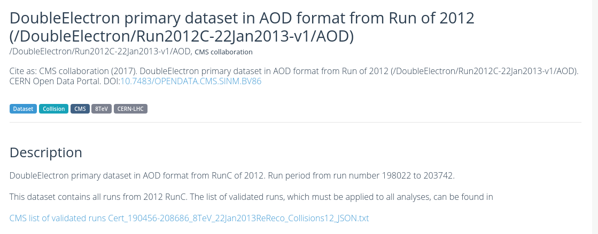

> ## Ready to go?
> The 3/4 of this lesson is done entirely in the browser. 
> 
> However, [Episode 4: What is in the data files?](https://cms-opendata-workshop.github.io/workshopwhepp-lesson-dataset-scouting/04-what-is-in-the-data/index.html), requires the use of a running CMSSW environment in the CMS open data Docker container. Make sure you have completed the [Docker pre-exercise](https://cms-opendata-workshop.github.io/workshopwhepp-lesson-docker/) if your operating system can run the CMSSW container.
{: .callout}

> ## You've got a great idea! What's next?
> Suppose you have a great idea that you want to test out with real data! You're going to want
> to know:
> * What **year** were the data taken that would work best for you?
> * In which **primary dataset** were the data of your interest stored?
> * What **Monte Carlo datasets** are available and appropriate for your studies?
>     * This may mean finding simulated physics processes that are **background** to your signal
>     * This may mean finding simulated physics processes for your **signal**, if they exist
>     * Possibly just finding simulated datasets where you *know* the answer, allowing you to test your new analysis techniques
{: .checklist}

In this lesson, we'll walk through the process of finding out what data and 
Monte Carlo are available to you, how to find them, and how to examine what 
data are in the individual data files. 

> ## What is a Monte Carlo dataset?
> You'll often hear about physicists using *Monte Carlo data* or sometimes just referring to
> *Monte Carlo*. In both cases, we are referring to *simulations* of different physics processes, 
> which then mimics how the particles would move through the CMS detector and how they
> might be affected (on average) as they pass through the material. This data is then 
> processed just like the "real" data (referred to as *collider data*). 
> 
> In this way, the analysts can see how the detector records different physics processes
> and best understand how these processes "look" when we analyze the data. This better
> helps us understand both the signal that we are looking for and the backgrounds
> which might hide what we are looking for. 
{: .callout}

First of all, let's understand how the data are stored and why we need certain
tools to access them. 

# The CERN Open Data Portal

In some of the earliest discussions about making HEP data publicly available there were many concerns about 
people using and analyzing "other people's" data. The concern centered around well-meaning scientists improperly 
analyzing data and coming up with incorrect conclusions. 

While no system is perfect, one way to guard against this is to only release well-understood, well-calibrated 
datasets and to make sure open data analysts *only* use these datasets. These datasets are given
a [Digital Object Identifier (DOI)](https://www.doi.org/) code for tracking. And if there
are ever questions about the validity of the data, it allows us to check the 
[data provenance](https://en.wikipedia.org/wiki/Data_lineage#:~:text=Data%20provenance%20refers%20to%20records,the%20data%20and%20its%20origins.).

## DOI

The [Digital Object Identifier (DOI)](https://www.doi.org/) system allows people to assign a unique
ID to any piece of digital media: a book, a piece of music, a software package, or a dataset. If you want to learn
more about the DOI process, you can learn more at their [FAQ](https://www.doi.org/faq.html). Assigning
of DOIs to CERN products is generally handled through [Zenodo](https://zenodo.org/). 

> ## Challenge!
> You will find that all the datasets have their DOI listed at the top of their page on the portal. 
> Can you locate where the DOI is shown for this dataset, Record 6029,
> [DoubleElectron primary dataset in AOD format from Run of 2012 (/DoubleElectron/Run2012C-22Jan2013-v1/AOD)](http://opendata.cern.ch/record/6029)
> 
> 
>
> With a DOI, you can create citations to any of these records, for example using a tool like [doi2bib](https://www.doi2bib.org).
{: .challenge}

## Provenance

You will hear experimentalists refer to the "*provenance*" of a dataset. From the 
[Cambridge dictionary](https://dictionary.cambridge.org/us/dictionary/english/provenance), provenance
refers to "*the place of origin of something*". 
The way we use it, we are referring to how we keep track of the history of how a dataset was 
processed: what version of the software was used for reconstruction, what period of calibrations
was used during that processing, etc. In this way, we are documenting the 
[data lineage](https://en.wikipedia.org/wiki/Data_lineage#:~:text=Data%20provenance%20refers%20to%20records,the%20data%20and%20its%20origins.)
of our datasets. 
> ## From [Wikipeda](https://en.wikipedia.org/wiki/Data_lineage#:~:text=Data%20provenance%20refers%20to%20records,the%20data%20and%20its%20origins.)
> Data lineage includes the data origin, what happens to it and where it moves over time.
> Data lineage gives visibility while greatly simplifying the ability to trace errors back to the root cause in a data analytics process.
{: .testimonial}

Provenance is an an important part of our data quality checks
and another reason we want to make sure you are using only vetted and calibrated data. 

## This lesson

For all the reasons given above, we encourage you to familiarize yourself with the search features and options
on the portal. With your feedback, we can also work to create better search tools/options and landing
points. 

This exercise will guide you through the current approach to finding data and Monte Carlo. Let's go!

