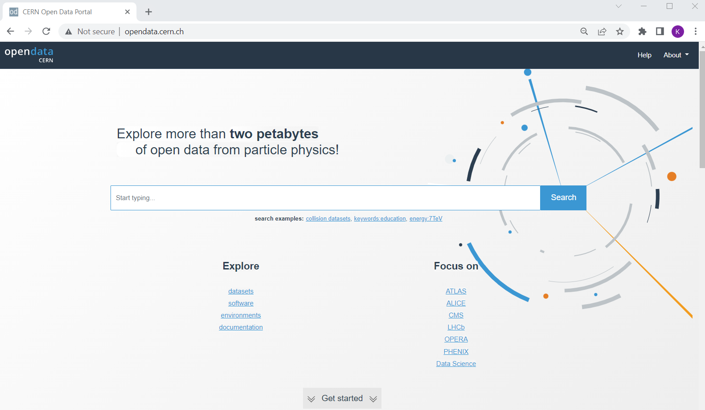
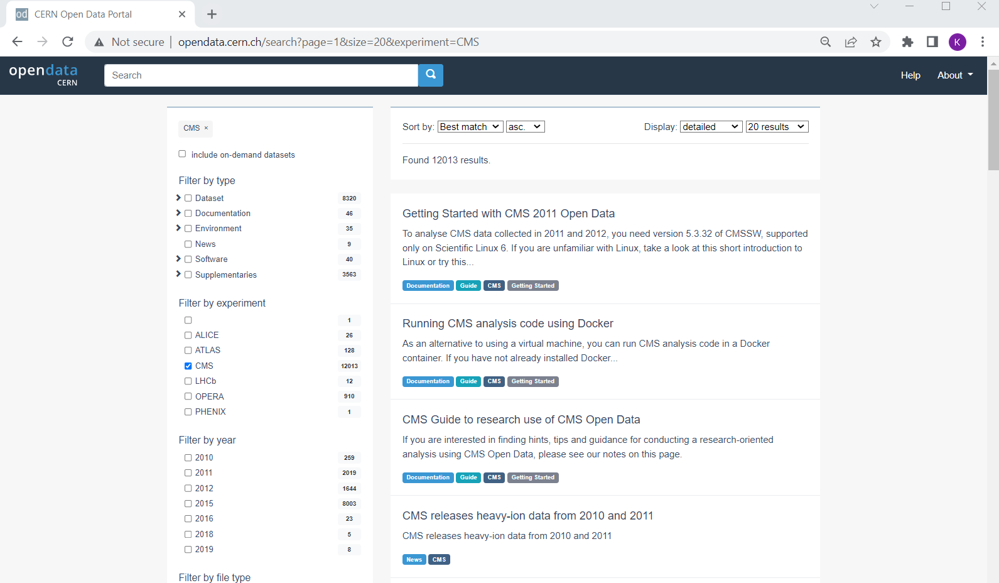

# CERN Open Data Portal

Our starting point is the landing page for [CERN Open Data Portal](http://opendata.cern.ch/).
You should definitely take some time to explore it. But for now we will select the 
CMS data. 

> ## CERN Open Data Portal
> The landing page for the [CERN Open Data Portal](http://opendata.cern.ch/).
> 
{: .callout}

> ## Make a selection!
> Find the CMS link under **Focus on** and click on it. 
{: .prereq}

## CMS-specific datasets

The figure below shows the website after we have chosen the CMS data. Note the left-hand
sidebar that allows us to filter our selections. Let's see what's there. 
(*Note! I've collapsed some of the options so while the order is the same when you view it,
 your webpage may look a little different at first glance.*)

> ## CERN Open Data Portal - CMS data
> The first pass to filter on CMS data
> 
{: .callout}

At first glance we can see a few things. First, there is an option to select only **Dataset** rather 
than documentation or software or similar materials. Great! Going forward we'll select **Dataset**. 

Next we see that there are a lot of entries for data from **2010**, **2011**, **2012**, and **2015**, the 7 TeV, 8 TeV and 13 TeV running periods. 
That's what we'll be working with for these exercises. 

> ## Coming soon!
> CMS make regular open data releases, and the next ones are already in preparation.
{: .testimonial}

> ## Make a selection!
> For the next module, let's select **Dataset** and **2012**.  
{: .prereq}


