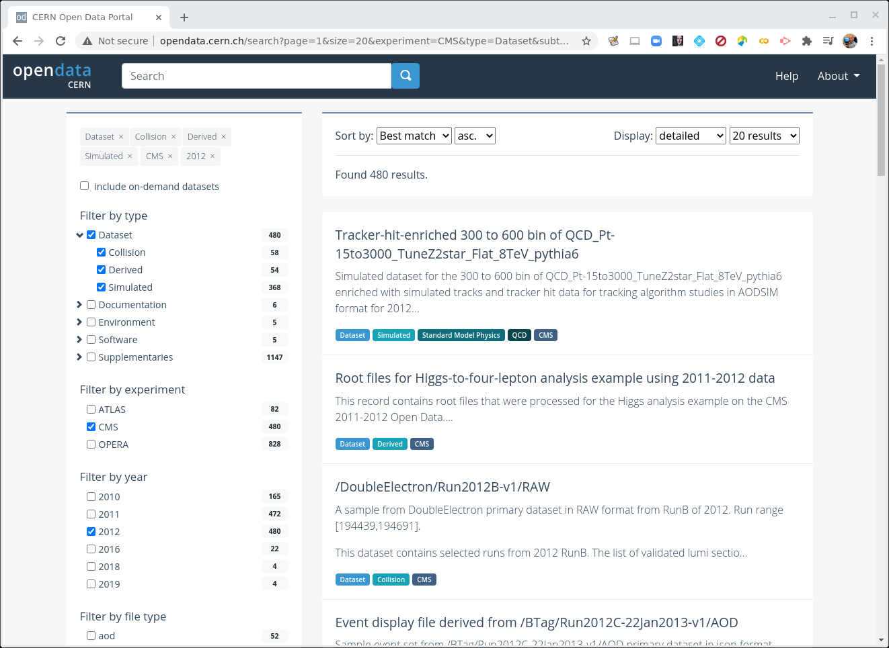
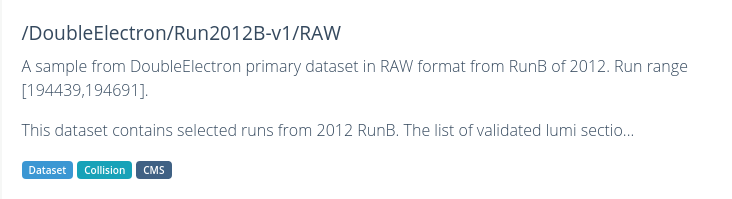
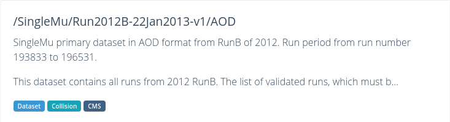
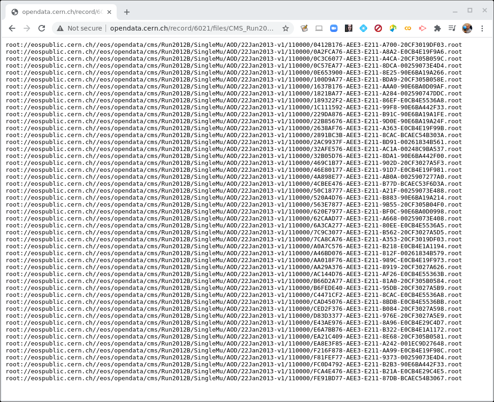
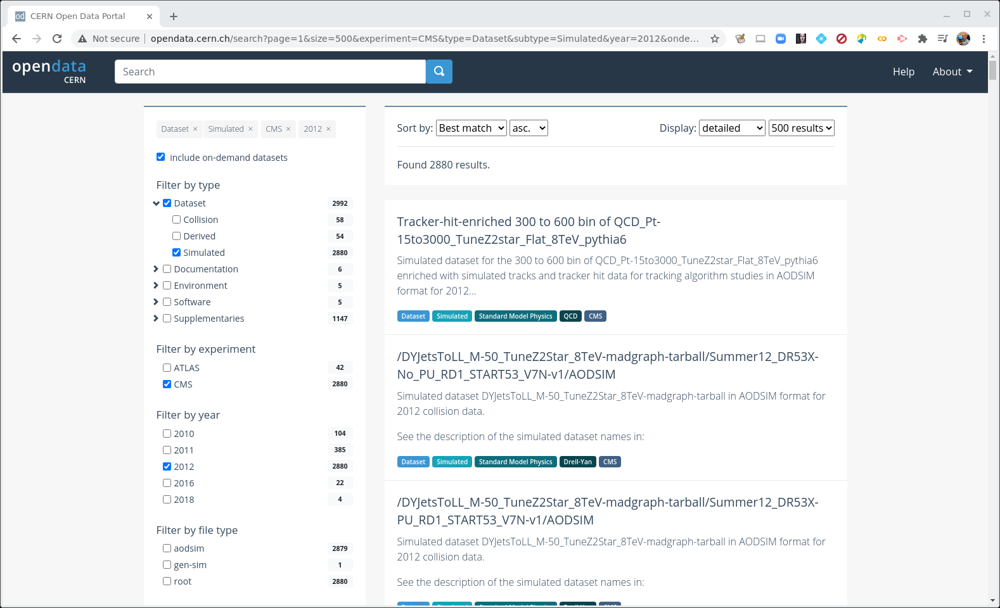
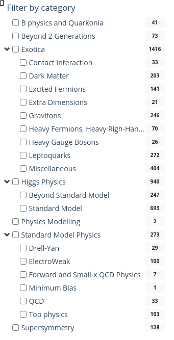

## Data and run periods

We make a distinction between *data* which come from the real-life CMS detector
and simulated *Monte Carlo* data. In general, when we say *data*, we mean the real, CMS-detector-created
data.

The main data available are from what is known as **Run 1** and spans 2010-2012. The first batch of **Run 2** data from 2015 was released in 2021. These run
periods can also be broken into **A**, **B**, **C**, and so-on, sub-periods and you may see
that in some of the dataset names. 

> ## Make a selection!
> If you are coming from the previous module you should have selected **CMS**, **Dataset**, and **2012**. 
{: .prereq}

> ## CERN Open Data Portal - CMS datasets
> Selecting CMS, Dataset, and 2012.
>
> *Your view might look slightly different than this screenshot as the available datasets and tools are regularly updated.*
>
> 
{: .callout}

When **Dataset** is selected, there are 3 subcategories: 
* **Collision** refers to the real data that came off of the CMS detector.
* **Derived** refers to datasets that have been further processed for some specific purpose, such as outreach
and education or the [ispy](https://ispy.web.cern.ch/1.5.0/) event display. 
* **Simulated** refers to Monte Carlo datasets. 

> ## Make a selection!
> Let's now unselect **Derived** and **Simulation** so that only the **Collision** option is set under **Dataset**. 
{: .prereq}

### Collision data

When you select **Collision** you'll see a lot of datasets with names that may be confusing. 
Let's take a look at two of them and see if we can break down these names.

> ## CERN Open Data Portal - CMS datasets
> Some samples from the 2012 collision data
>
> [/DoubleElectron/Run2012B-v1/RAW](http://opendata.cern.ch/record/65)
> 
> [/SingleMu/Run2012B-22Jan2013-v1/AOD](http://opendata.cern.ch/record/6021)
> 
{: .callout}

There are three (3) parts to the names, separated by `/'. 

**Dataset name**

*DoubleElectron* or *SingleMu* is the name of the dataset. Events stored in these primary datasets were selected by *triggers* of usually of a same type. For each dataset, the list of triggers is listed in the dataset record. 
You will learn more about them in the trigger lesson during the workshop, 
but for now, remind yourself that they
select out some subset of the collisions based on certain criteria in the hardware
or software. 

Some of the dataset names are quite difficult to intuit what they mean. Others should be roughly understandable. For example, 

* **DoubleElectron** contains mainly events with at least two electrons above a certain energy threshold. 
* **SingleMu** contains mainly events with at least one muon above a certain momentum threshold. 
* **MinimumBias** events are taken without any trigger or selection criteria. 

**Run period**

*Run2012B-v1* and *Run2012B-22Jan2013-v1* refer to when the data were taken and in the case of the second, when
the data were processed. The details are not so important for you because CMS only releases
vetted data. If you were a CMS analyst working on the data as it was being processed, 
you might have to shift your analysis to a different dataset once all calibrations were completed. 

**Data format**

* **RAW** files contain information directly from the detector in the form of hits from the TDCs/ADCs. 
(TDC refers to to *[Time to Digital Converter](https://en.wikipedia.org/wiki/Time-to-digital_converter)* and 
ADC refers to to *[Analog to Digital Converter](https://en.wikipedia.org/wiki/Analog-to-digital_converter)*. 
Both of these are pieces of electronics which convert signals from the components of the CMS detector to 
digital signals which are then stored for later analysis.)
These files are not a focus of this workshop. 
* **AOD** stands for *Analysis Object Data*. This is the first stage of data where analysts can really start
physics analysis. 
* **MINIAOD** is a slimmer format of AOD, in use from Run 2 open data on. Often, the experiment will slim this down and drop some subsets of the data stream into *NanoAOD*, but the current open data were not yet reprocessed in that format.

### Further information

If you click on the link to any of these datasets, you will find even more information, including

* The size of the dataset
* Information on the what is the recommended software release to analyze this dataset
* How were the data selected including the details of the trigger selection criteria. More
on this in a later lesson.
* Validation information
* A list of all the individual ROOT files in which this dataset is stored

There are multiple text files that contain the paths to these ROOT files. If we click on
any one of them, we see something like this. 

> ## CERN Open Data Portal - CMS datasets
> Sample listing of some of the ROOT files in the 
> [/SingleMu/Run2012B-22Jan2013-v1/AOD](http://opendata.cern.ch/record/6021)
> dataset.
> 
{: .callout}

The prepended `root:` is because of how these files are accessed. We'll use these directory
paths when we go to inspect some of these files. 

## Monte Carlo

We can go through a similar exercise with the Monte Carlo data. One major difference is that
the Monte Carlo are not broken up by trigger. Instead, when you analyze the Monte Carlo, you will
apply the trigger to the data to simulate what happens in the real data. You will learn
more about this in the upcoming trigger exercise. 

For now, let's look at some of the Monte Carlo datasets that are available to you. 

> ## Make some selections! But first make some unselections!
> Unselect everything except for **2012**, **CMS**, **Dataset**, and **Simulated** (under **Dataset**).  
> 
> Next, select a new button near the top of the left-hand sidebar, **include on-demand datasets**. 
> This will give us some search options related to the Monte Carlo samples. 
{: .prereq}

> ## CERN Open Data Portal - CMS datasets
> Selection of the Monte Carlo dataset search options
> 
{: .callout}

There are a lot of Monte Carlo samples! It's up to you to determine which ones 
might contribute to your background. The names try to give you some sense of
the primary process, subsequent decays, the beam energy 
and specific simulation software (e.g. Pythia), but if you have questions, 
reach out to the organizers through 
[Mattermost](https://mattermost.web.cern.ch/cmsodws2022/channels/town-square).

As with the collision data, here are three (3) parts to the names, separated by `/'. 

Let's look at one of them:
[/DYJetsToLL_M-50_TuneZ2Star_8TeV-madgraph-tarball/Summer12_DR53X-No_PU_RD1_START53_V7N-v1/AODSIM](http://opendata.cern.ch/record/7729)

**Physics process/Monte Carlo sample**

*DYJetsToLL_M-50_TuneZ2Star_8TeV-madgraph-tarball* is hard to understand at first glance, but
if we take our time we might be able to intuit some of the meaning. This appears
to simulate a [Drell-Yan process](https://en.wikipedia.org/wiki/Drell%E2%80%93Yan_process) 
in which two quarks interact to produce a virtual photon/Z boson which then couples to 
two leptons. The *M-50* refers to a selection that has been imposed requiring the mass of the di-lepton 
pair to be above 50 GeV/c^2 and the remaining fields tell us something about what 
software was used to generate this (*madgraph*) the beam energy (*8TeV*) and some
extra, quite frankly, Byzantine text. :)

**Global tag**

*Summer12_DR53X-No_PU_RD1_START53_V7N-v1* refers to how and when this Monte Carlo was processed. 
The details are not so important for you because the open data coordinators have
taken care to only post vetted data. But it is all part of the data provenance.

**Data format**

The last field refers to the data format and here again there is a slight difference.

* **AODSIM** or **MINIAODSIM** stands for *Analysis Object Data - Simulation*. This is the same as 
the **AOD** or **MINIAOD** format used in the collision data, except that there are some extra fields that
store information about the original, generated 4-vectors at the parton level, as well
as some other Monte Carlo-specific information. 

One difference is that you will
want to select the Monte Carlo events that pass certain triggers at the time of your analysis, while
that selection was already done in the data by the detector hardware/software itself. 

If you click on any of these fields, you can see more details about the samples, similar
to the collision data. 

## More Monte Carlo samples

If you would like a general idea of what other physics processes have been simulated, you can
check scroll down the sidebar until you come to *Filter by category*. 

> ## CERN Open Data Portal - CMS datasets
> Selection of the Monte Carlo dataset search options
> 
{: .callout}

You may have to do a bit of poking around to find the dataset that is most appropriate for what
you want to do, but remember, 
you can always reach out to the organizers through 
[Mattermost](https://mattermost.web.cern.ch/cmsodwswhepp24/channels/town-square).

## Summary

By now you should have a good sense of how to find your data using the Open Data Portal's search tools. 


